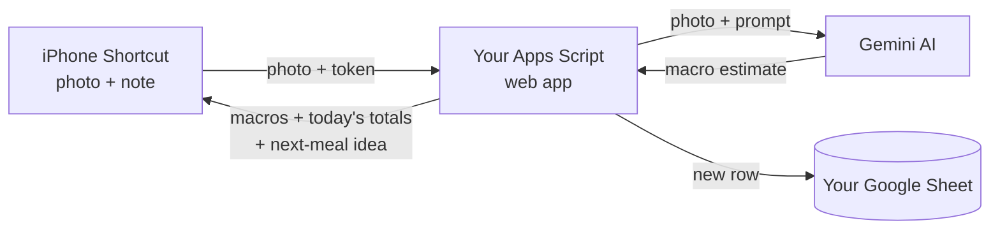

# Macro Logger

**Snap a photo of your meal and its calories, protein, carbs and fat are logged to your own Google Sheet.** It's free and there's no app to install. It runs on an iPhone Shortcut, Google Sheets and Google's Gemini AI.


- 📸 **Photo → macros in seconds.** The AI estimates each part of the meal. Keep your hand in the photo so it can judge portion size.
- 📊 **Daily totals vs your targets.** Each day's total turns green when you hit a target and red when you haven't yet.
- 🍽️ **What to eat next.** After each meal it suggests 3 meals that fill your remaining macros, based on foods you actually eat.
- ⚖️ **Weight tracking** with a 7-day average and a chart.

---

## Setup video

[](https://youtu.be/TODO_YOUTUBE_ID)

The video follows the same numbered steps as below. Use the chapters to jump to the step you're on.

---

## Before you start

You'll need:
- An **iPhone** with the Shortcuts app (it comes pre-installed)
- A **Google account**
- A **laptop or computer**. Steps 1–7 are much easier on a big screen.
- About **20–30 minutes**

**Cost:** free. Google's free Gemini allowance is plenty for logging your meals every day.

**Privacy in one line:** your meals and weight are saved only in **your own** Google Sheet, and nobody else, including the author of this project, can see them. Note that on the free Gemini plan, Google may use the photos you send to improve its products.

---

## Setup

### Step 1: Copy the Sheet

1. Open this link while signed in to Google: **[Make a copy of Macro Logger](TODO_TEMPLATE_URL)**
2. Click **Make a copy**.

The copy is yours. It already has the code and the tabs (`Log`, `Targets`, `Daily`) set up.

<details>
<summary>Link not working? Install it by hand instead</summary>

1. Go to [sheets.new](https://sheets.new) to create a blank Google Sheet.
2. In the Sheet's menu, click **Extensions → Apps Script**.
3. Delete everything in the editor, then paste in the whole of [macro-logger.gs](macro-logger.gs). Click 💾 **Save**.
4. At the top of the editor, pick `setupTargets` from the function dropdown and click **▶ Run**. The first time, it asks for permission: follow Step 5 below, then come back.
5. Pick `setupDaily` and click **▶ Run**.

> ⚠️ Open Apps Script **from inside the Sheet** (Extensions → Apps Script). A project created on script.google.com won't work.

</details>

### Step 2: Get a free Gemini API key

1. Go to [aistudio.google.com](https://aistudio.google.com) and sign in.
2. Click **Get API key → Create API key**.
3. Copy the key and keep the tab open. You need it in the next step.

> Treat this key like a password. Don't post it anywhere.

### Step 3: Add your key and make up a password

1. In your copied Sheet, click **Extensions → Apps Script**.
2. On the left, click ⚙️ **Project Settings**.
3. Under **Time zone**, choose your own time zone.
4. Scroll to **Script Properties** → **Add script property**, and add these two:

| Property | Value |
|---|---|
| `GEMINI_API_KEY` | the key from Step 2 |
| `SHORTCUT_TOKEN` | a password you make up, with no spaces (e.g. `purple-tiger-2931`) |

5. Click **Save script properties**.

The `SHORTCUT_TOKEN` is what stops other people from writing to your Sheet. You'll type it into the Shortcut in Step 8, so write it down.

### Step 4: Change your time zone and hand size (skip if you're in Malaysia)

In the Apps Script editor, click `Code.gs` (or whatever the code file is called) on the left. Near the top, change these lines:

```js
const TIME_ZONE = 'Asia/Kuala_Lumpur';   // your time zone, e.g. 'Asia/Singapore', 'Europe/London'
const HAND_LENGTH_CM = 16.5;             // base of your palm to the tip of your middle finger
const HAND_WIDTH_CM = 8.4;               // across your palm, side to side
```

- **Time zone:** use a name from [this list](https://en.wikipedia.org/wiki/List_of_tz_database_time_zones) (the "TZ identifier" column). Without it, meals land on the wrong day.
- **Hand size:** measure your own hand with a ruler. The AI uses your hand in the photo to judge portions, so this makes estimates more accurate for everyone, including people in Malaysia.

Click 💾 **Save**.

> The AI is currently tuned for Malaysian food. It still works for other food, but the suggestions will lean Malaysian.

### Step 5: Give the script permission

1. At the top of the editor, pick `authorize` from the function dropdown and click **▶ Run**.
2. Click **Review permissions** and choose your Google account.
3. You'll see **"Google hasn't verified this app."** This is expected, because you're the developer of your own copy. Click **Advanced → Go to (project name) (unsafe) → Allow**.

### Step 6: Turn it on (deploy)

1. In the editor, click **Deploy → New deployment**.
2. Click the ⚙️ next to "Select type" → **Web app**.
3. Set:
   - **Execute as:** Me
   - **Who has access:** Anyone
4. Click **Deploy** and copy the **Web app URL**. It ends in `/exec`.

**Check it works:** paste the URL into a browser. You should see a line containing `"status":"ok"`.

> "Anyone" is safe here: without your `SHORTCUT_TOKEN`, nobody can add anything to your Sheet.

### Step 7: Fill in your details

In your Sheet, open the **Targets** tab and fill in the yellow cells:

| Cell | What to enter |
|---|---|
| B2 | Sex |
| B3 | Age |
| B4 | Weight (kg) |
| B5 | Height (cm) |
| B6 | Activity level (dropdown) |
| B7 | Goal: Weight Loss, Maintenance or Weight Gain (dropdown) |

Your daily calorie, protein, carb and fat targets appear below these cells.

### Step 8: Add the Shortcuts to your iPhone

Open these links **on your iPhone** and tap **Add Shortcut**:

- **[Log Meal](TODO_LOG_MEAL_URL)**: take a photo and log it
- **[Log Weight](TODO_LOG_WEIGHT_URL)**: type in your weight

Each one asks you two questions when you add it:
1. **Web app URL:** paste the `/exec` URL from Step 6.
2. **Token:** type the `SHORTCUT_TOKEN` from Step 3, exactly the same.

> Tip: to get the URL onto your phone, email it to yourself or use Notes. Don't paste it into a group chat.

### Step 9: Try it

1. Run **Log Meal** and take a photo of a real meal, with your hand in the shot.
2. The first time, tap **Allow** for the camera, then **Always Allow** when it asks to connect to `script.google.com`.
3. After a few seconds you should get a notification with the food, calories and macros, and a new row in the **Log** tab.

🎉 You're set up.

**Optional: daily weight reminder.** In Shortcuts, go to **Automation → + → Time of Day**, pick a time, then choose **Daily → Run After Confirmation → Log Weight**.

---

## Keep your link and token private

Anyone with **both** your Web app URL and your `SHORTCUT_TOKEN` can add entries to your Sheet. So:

- **Don't share your Shortcuts.** Your copies contain your URL and token. Send friends the links in this README instead.
- **Blur the URL and token** in any screenshot or screen recording.

**If your token gets out**, change `SHORTCUT_TOKEN` in Script Properties (Step 3) and in both Shortcuts. The old token stops working straight away. If your Gemini key gets out, delete it in AI Studio and make a new one.

---

## Updating to a new version

Your copy doesn't update on its own. When a new version is released:

1. Open your Sheet → **Extensions → Apps Script**.
2. Select all the code, delete it, paste in the new [macro-logger.gs](macro-logger.gs), and click 💾 **Save**.
3. **Redo your Step 4 changes** (time zone, hand size) if you made any. Pasting the new code replaces them.
4. **Deploy → Manage deployments → ✏️ (Edit) → Version: New version → Deploy.**

> ⚠️ **Don't skip step 4.** If you only save, your Shortcuts keep running the old code. Your URL stays the same, so the Shortcuts don't need changing.

If the release notes mention a function to run (e.g. `setupTargets`), run it once. These functions keep your existing details.

---

## Troubleshooting

| What you see | What to do |
|---|---|
| *"Couldn't convert from Rich Text to Dictionary"* | The script sent back an error page. Check the rows below, and make sure you deployed after your last change. |
| A Google sign-in page | Step 6: **Who has access** must be **Anyone**, not "Anyone with Google account". |
| *"Sorry, unable to open the file at present"* | The script wasn't created from inside the Sheet. Use Step 1 again. |
| `unauthorized` | The token in the Shortcut doesn't match `SHORTCUT_TOKEN` exactly (check spaces and capitals). |
| `Gemini 429` | You've used today's free Gemini allowance. It resets at midnight US Pacific time. |
| `Gemini 503` | Gemini is busy. Try again in a minute. |
| *"The request timed out"* | Try again. Gemini is sometimes slow. |
| I changed the code but nothing's different | Deploy a **New version** (see Updating, step 4). |
| Blank notification | Re-add the Shortcut from the link in Step 8. |

---

## How it works



Everything runs in your own Google account: the Shortcut talks directly to your copy of the script, and there's no server in the middle.

Want to contribute or see how it's built? Start with [HANDOVER.md](HANDOVER.md).
