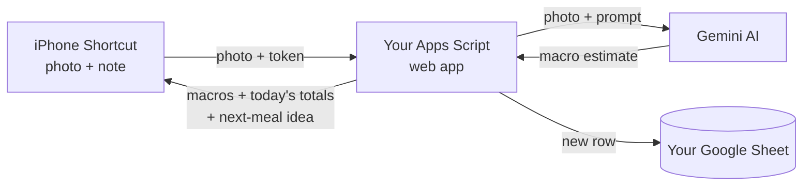

# Macro Logger

**Snap a photo of your meal and its calories, protein, carbs and fat are logged to your own Google Sheet.** It's free and there's no app to install. It runs on an iPhone Shortcut, Google Sheets and Google's Gemini AI.

- 📸 **Photo → macros in seconds.** The AI estimates each part of the meal. Keep your hand in the photo so it can judge portion size.
- 📊 **Daily totals vs your targets.** Each day's total turns green when you hit a target and red when you haven't yet.
- 🍽️ **What to eat next.** After each meal it suggests 3 meals that fill your remaining macros, based on foods you actually eat.
- ⚖️ **Weight tracking** with a 7-day average and a chart.

---

## Setup video

The video follows the same numbered steps as below. Use the chapters to jump to the step you're on.

---

## Before you start

You'll need:
- An **iPhone** with the Shortcuts app (it comes pre-installed)
- A **Google account**
- A **laptop or computer**. Steps 1–5 are much easier on a big screen.
- About **20 minutes**

**Cost:** free. Google's free Gemini allowance is plenty for logging your meals every day.

**Privacy in one line:** your meals and weight are saved only in **your own** Google Sheet, and nobody else, including the author of this project, can see them. Note that on the free Gemini plan, Google may use the photos you send to improve its products.

---

## Setup

### Step 1: Copy the Sheet

1. Open this link while signed in to Google: **[Make a copy of Macro Logger](TODO_TEMPLATE_URL)**
2. Click **Make a copy**.

The copy is yours, and the code comes with it. After a few seconds a **Macro Logger** menu appears at the top of the Sheet, next to Help. If it doesn't, reload the page.

Link not working? Install it by hand instead

1. Go to [sheets.new](https://sheets.new) to create a blank Google Sheet.
2. In the Sheet's menu, click **Extensions → Apps Script**.
3. Delete everything in the `Code.gs` file, paste in the whole of [src/Code.js](src/Code.js), and click 💾 **Save**.
4. Click ⚙️ **Project Settings** and tick **Show "appsscript.json" manifest file in editor**.
5. Go back to the editor (**<>** on the left), open `appsscript.json`, replace everything in it with [src/appsscript.json](src/appsscript.json), and click 💾 **Save**.
6. Close the Apps Script tab, then reload the Sheet. The **Macro Logger** menu appears.

> ⚠️ Open Apps Script **from inside the Sheet** (Extensions → Apps Script). A project created on script.google.com won't work.

### Step 2: Get a free Gemini API key

1. Go to [aistudio.google.com](https://aistudio.google.com) and sign in.
2. Click **Get API key → Create API key**.
3. Copy the key. You'll paste it in Step 3.

> Treat this key like a password. Don't post it anywhere.

### Step 3: Run the setup

1. In your Sheet, click **Macro Logger → Set up / repair**.
2. Google asks for permission. Choose your account.
3. You'll see **"Google hasn't verified this app."** This is expected, because you're the developer of your own copy. Click **Advanced → Go to (project name) (unsafe) → Allow**.
4. Click **Macro Logger → Set up / repair** again. Setup doesn't run on the same click that asks for permission.
5. Paste your Gemini key from Step 2 when it asks.

Setup then asks for your **Web app URL**. Leave that box open and do Step 4.

### Step 4: Turn on your web app (deploy)

1. In your Sheet, click **Extensions → Apps Script**. The code editor opens in a new tab.
2. Click **Deploy → New deployment**.
3. Click the ⚙️ next to "Select type" → **Web app**.
4. Set:
   - **Execute as:** Me
   - **Who has access:** Anyone
5. Click **Deploy** and copy the **Web app URL**. It ends in `/exec`.
6. Go back to the Sheet tab and paste the URL into the setup box.

> "Anyone" is safe here: without your token, nobody can add anything to your Sheet.

Setup checks that the URL works. Then a window called **Your Shortcut details** shows your **Web app URL** and **Token**. You'll need both in Step 6. You can open this window again any time from **Macro Logger → Show my Shortcut details**.

### Step 5: Fill in your details

**Settings tab:** change the yellow cells that don't fit you. Each row explains itself.

| Setting | Why it matters |
|---|---|
| `time_zone` | So meals land on the right day. Change it if you're not in Malaysia. |
| `hand_length_cm`, `hand_width_cm` | **Measure your hand.** The AI uses your hand in the photo to judge portion size. |
| `usual_food` | The kind of food you eat, e.g. `Japanese home cooking` |
| `about_me` | A few words for meal suggestions, e.g. `a university student in Malaysia` |

If you change `time_zone` or `day_start_hour`, click **Macro Logger → Set up / repair** once afterwards.

**Targets tab:** fill in the yellow cells (sex, age, weight, height, activity level, goal). Your daily calorie, protein, carb and fat targets appear below them.

### Step 6: Add the Shortcuts to your iPhone

Open these links **on your iPhone** and tap **Add Shortcut**:

- **[Log Meal](TODO_LOG_MEAL_URL)**: take a photo and log it
- **[Log Weight](TODO_LOG_WEIGHT_URL)**: type in your weight

Each one asks you two questions when you add it. Paste the **Web app URL** and the **Token** from Step 4.

> Tip: to get them onto your phone, copy them into Notes or email them to yourself. Don't paste them into a group chat.

### Step 7: Try it

1. Run **Log Meal** and take a photo of a real meal, with your hand in the shot.
2. The first time, tap **Allow** for the camera, then **Always Allow** when it asks to connect to `script.google.com`.
3. After a few seconds you should get a notification with the food, calories and macros, and a new row in the **Log** tab.

🎉 You're set up.

**Optional: daily weight reminder.** In Shortcuts, go to **Automation → + → Time of Day**, pick a time, then choose **Daily → Run After Confirmation → Log Weight**.

---

## Keep your link and token private

Anyone with **both** your Web app URL and your Token can add entries to your Sheet. So:

- **Don't share your Shortcuts.** Your copies contain your URL and token. Send friends the links in this README instead.
- **Blur the URL and token** in any screenshot or screen recording.

**If your token gets out:** click **Macro Logger → Make a new Shortcut token** and paste the new token into both Shortcuts. The old one stops working straight away.
**If your Gemini key gets out:** delete it in AI Studio, make a new one, and click **Macro Logger → Change Gemini key**.

---

## Updating

When a new version is out, your meal notification and the **Daily** tab say **"Update available"**. To install it, click **Macro Logger → Check for updates**. A window shows the new code and walks you through it:

1. Click **Copy the new code**.
2. Open **Extensions → Apps Script**. In `Code.gs`, select everything, paste, and click 💾 **Save**.
3. Click **Deploy → Manage deployments → ✏️ Edit → Version: New version → Deploy.**
4. Reload the Sheet.

> ⚠️ **Don't skip step 3.** If you only save, your Shortcuts keep running the old version.

Your meals, settings, web app URL and token stay the same, so your Shortcuts keep working. See [what's new](CHANGELOG.md).

> Macro Logger never changes its own code. Updates only happen when you paste them in, and you can read every release here first.

---

## Troubleshooting

| What you see | What to do |
|---|---|
| No **Macro Logger** menu | Reload the Sheet and wait a few seconds. |
| Setup says the URL didn't work | In Apps Script, **Deploy → Manage deployments**: check **Who has access** is **Anyone**, then paste the `/exec` URL again. |
| *"Couldn't convert from Rich Text to Dictionary"* | The script sent back an error page. Click **Macro Logger → Set up / repair** to check your URL, then try again. |
| I pasted new code but nothing's different | Deploy a **New version** (see Updating, step 3). |
| `unauthorized` | The token in the Shortcut doesn't match. Open **Macro Logger → Show my Shortcut details** and paste it again. |
| `Gemini 429` | You've used today's free Gemini allowance. It resets at midnight US Pacific time. |
| `Gemini 503` | Gemini is busy. Try again in a minute. |
| *"The request timed out"* | Try again. Gemini is sometimes slow. |
| Meals land on the wrong day | Check `time_zone` on the Settings tab, then click **Set up / repair**. |
| Google asks for permission again after an update | Expected when a new version needs it. Approve it the same way as Step 3. |
| Blank notification | Re-add the Shortcut from the link in Step 6. |

---

## How it works

Everything runs in your own Google account: the Shortcut talks directly to your copy of the script, and there's no server in the middle.

Want to contribute or see how it's built? Start with [HANDOVER.md](HANDOVER.md).
